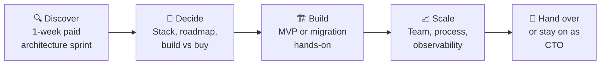

<!-- ============================================================
     Replace YOUR_GITHUB_USERNAME (5 places) before publishing.
     This file goes in a public repo named exactly like your username.
     ============================================================ -->

---

### 👋 The short version

I'm the engineer founders call when the product works **but the system behind it won't survive the next stage of growth.**

For 18+ years I've designed, rescued and scaled software for companies in the **UK and US** — from **Shell Energy** and **OVO Energy** platforms to **Travelers Insurance** systems used by **2M+ people**. Today I combine that enterprise discipline with hands-on **Generative AI and multi-agent engineering**, so early-stage teams get both: speed now, and an architecture that doesn't need a rewrite later.

> 🎯 **Open to:** Founding CTO · Fractional CTO · Principal Architect · Director of Engineering
> 🌍 **Based in India, built for global teams** — 8 years running UK–India delivery; comfortable with **UK hours and US morning overlap**.

---

### 💼 What I do for founders & leadership teams

| If you're... | I help you... |
|---|---|
| 🚀 **A pre-seed / seed founder** | Turn an idea into a shippable, investor-ready MVP — and make the build-vs-buy and stack decisions you won't regret at Series A. |
| 🏗️ **Scaling past product-market fit** | Break the monolith, stabilise releases, and migrate to cloud-native **without stopping the business** (I've done it with zero downtime). |
| 🤖 **Adding AI to your product** | Move from "ChatGPT demo" to production GenAI — LLM orchestration, RAG, agent workflows, cost and governance guardrails. |
| 🧭 **A CEO without a technical partner** | Act as your technical voice in the room — roadmap, hiring, vendor due diligence, and translating architecture into business cost and risk. |

---

### 📈 Proof, not adjectives

<table>
<tr>
<td align="center" width="25%"><h2>18+</h2>years building production software</td>
<td align="center" width="25%"><h2>2M+</h2>users on an enterprise insurance platform I led</td>
<td align="center" width="25%"><h2>40%</h2>performance gain from a zero-downtime microservices migration</td>
<td align="center" width="25%"><h2>0</h2>security breaches across an 8-year pen-tested engagement</td>
</tr>
<tr>
<td align="center"><h2>60–80%</h2>API efficiency gain in my Cal.com open-source integration</td>
<td align="center"><h2>30%</h2>faster APIs for 50K+ daily users</td>
<td align="center"><h2>100K+</h2>documents/month through platforms I owned</td>
<td align="center"><h2>8–12</h2>engineers led across UK & India pods</td>
</tr>
</table>

---

### 🛠️ Featured work

#### 🗓️ Office 365 Calendar Integration — [Cal.com](https://github.com/calcom/cal.com) (open source)
Shipped **6,600+ lines of production TypeScript** into one of the most popular open-source scheduling platforms — OAuth 2.0 + Microsoft Graph, with a caching and webhook architecture that cut API calls by **60–80%**.
→ [View PR #21854](https://github.com/calcom/cal.com/pull/21854)

#### 🤖 ORION — Multi-Agent AI-SDLC Framework
A framework where **9 specialised AI agents** carry work through a **7-stage pipeline (Discover → Ship)** — with PR-based hand-offs, CI merge gates, reviewer-agent verdicts and architecture decision records keeping the agents in check. Built to answer one question: *how do you let AI write code without losing engineering governance?*

#### 🏠 InfographicAI — Generative AI for Real Estate
Conceived and built end-to-end: a Python/FastAPI product orchestrating **OpenAI + Ideogram** to turn raw property data into ready-to-publish marketing visuals. Product definition, prompt engineering, and shipping — all mine.

#### ⚡ Legacy-to-Cloud Modernisation — UK Energy SaaS
Principal technical authority for a debt-recovery platform serving **Shell Energy** and **OVO Energy**. Led the phased move from legacy WCF to **.NET Core microservices** with **zero downtime** and a **40%** performance lift, plus a full security-hardening and pen-testing programme.

---

### 🧠 How I engage

Most engagements start with a **short paid architecture sprint** — you get a concrete plan in a week, and we both find out if we work well together before any bigger commitment.

---

### 🧰 Tech I bring to the table

**Languages & Frameworks**

**AI & Agentic Engineering**

**Cloud & DevOps**

**Data**

**Architecture:** Microservices · CQRS · Event-Driven Design · Clean Architecture · API Strategy · OAuth 2.0 · Security Hardening (CSP, HSTS, OWASP)

---

### 🏅 Certifications

Plus: AI Engineering · Generative AI & LLMs · Prompt Engineering · Microsoft Copilot (Gen AI)

---

### 🗺️ The journey

<b>18 years in one scroll — click to expand</b>

 

| When | Role | Where it mattered |
|---|---|---|
| **2025 – Now** | Principal Engineer & Architect (Independent) | Advising product companies on cloud-native strategy and AI adoption; building ORION and InfographicAI; shipping to Cal.com open source |
| **2017 – 2025** | Principal Technology Consultant · **Nexum Software (UK)** | 8 years as technical authority for an energy SaaS platform (Shell Energy, OVO Energy); zero-downtime microservices migration; zero breaches |
| **2016 – 2017** | Technology Lead · **Infosys** → Travelers Insurance (US) | Led delivery of a 2M+ user insurance platform; cut delivery cycle time 25% |
| **2009 – 2016** | System Analyst · **Cybage** → Upland Software (US) | Document management for 10+ enterprise clients; 100K+ docs/month; 30% faster APIs |
| **2007 – 2009** | Software Engineer → Senior Software Engineer | Where it started: ASP.NET, C#, SQL Server |

🎓 M.S. & B.S. Computer Applications — Gujarat University

---

### 💭 What I believe about building software

- **Boring architecture wins.** Pick technology your next five hires already know.
- **Migrations should be invisible.** If customers notice, it wasn't planned well enough.
- **AI is a teammate, not a shortcut.** Agents need code review, gates and accountability — just like people.
- **A CTO's real output is decisions.** Code matters; clear trade-offs explained to the board matter more.

---

### 📊 GitHub at a glance

---

### 🤝 Building something ambitious?

**If you're a founder looking for a technical partner, or a leadership team that needs an architect who still ships — let's talk.**
I reply to every message within 24 hours.

